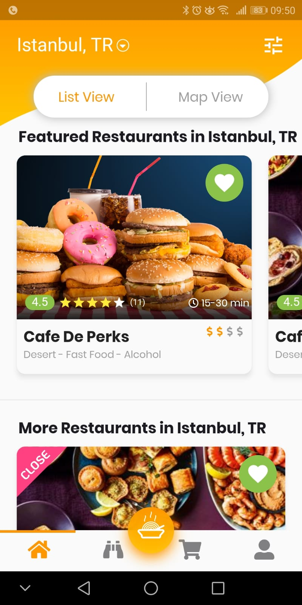
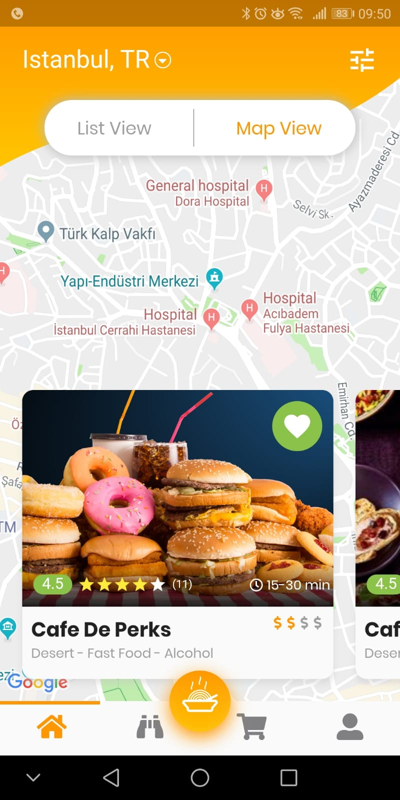
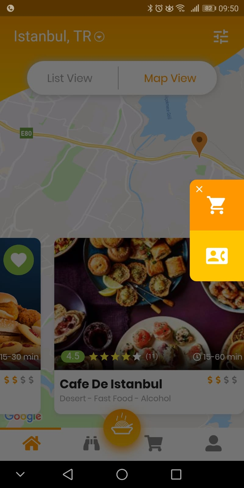

# Flutter FoodApp Desing Challenge 

  This repo gives you amazing flutter Food App UI design! If you like design please star to support me!
  
  ### :heart: Star :heart: the repo to support the project or :smile:[Follow Me](https://github.com/kalismeras61). Thanks!

  Page Name | Image   
 --- | --- 
 [Restaturants Listing View] | 
 [Restaturants Map View] | 
  [Restaturants App Drawer] | 

## Getting Started

For Google Maps using you need to add API key in AndroidManifest.xml file.

Note : This project requires minumum 1.1.7 flutter version! You need to upgrade your flutter version.

Here is the details : https://pub.dartlang.org/packages/google_maps_flutter
